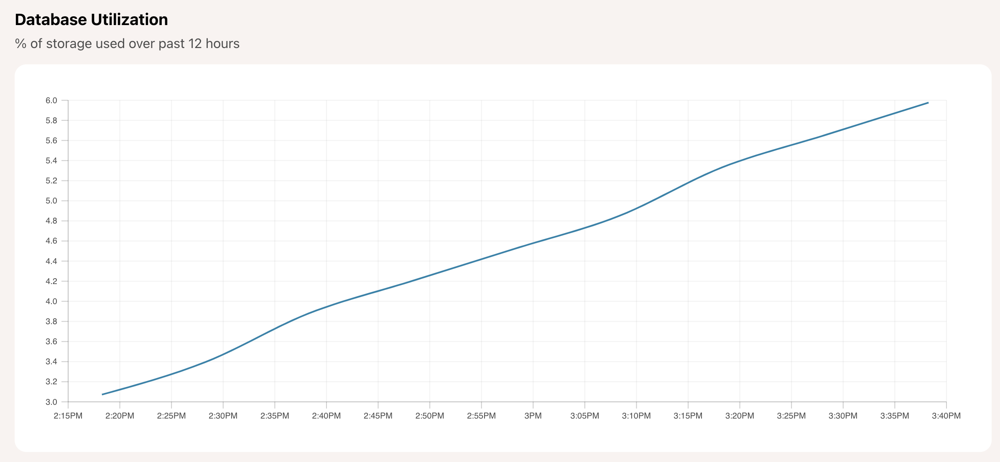
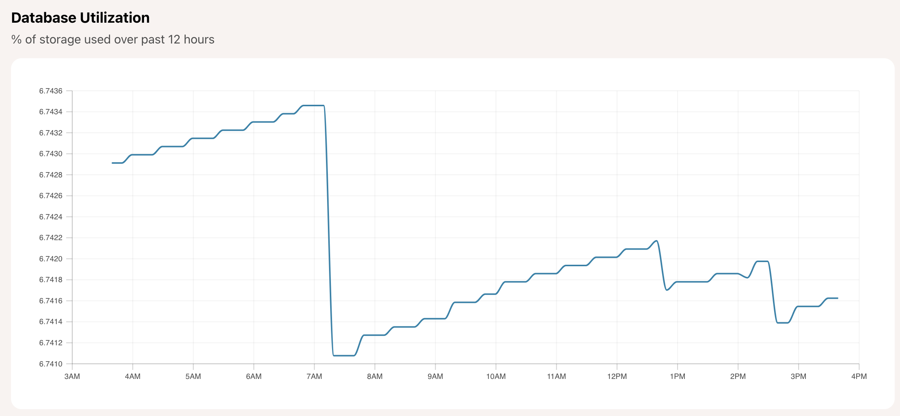

# Troubleshooting

## Storage

### Why is my storage utilization increasing?

On an idle instance, you may notice your storage utilization increasing:



This is from queries being performed on your instance to collect performance metrics. The storage used by metrics queries will be freed on a schedule, so you may see a sawtooth pattern in your storage utilization graph:



Depending on which Stack you have selected, the amount of temporary storage utilization will vary.

## Network

### Connection hanging

- There is a known [issue](https://github.com/traefik/traefik/issues/9929#issuecomment-1608993684) when connecting with the default sslmode 'prefer' where if the database is restarting while you start a connection, it will hang even after the database is back up.
- Please use the sslmode 'require' to avoid this issue, and Tembo team will work on getting this issue resolved for sslmode 'prefer'.
- Tembo will only accept encrypted connections, regardless of sslmode configured on the client side.

```
psql 'postgresql://postgres:***@***.data-1.use1.tembo.io:5432?sslmode=require'
```

### Tembo requires PostgreSQL clients of version 14+

- [Server Name Indication](https://en.wikipedia.org/wiki/Server_Name_Indication) was introduced in version 14, and this feature is used in Tembo to route requests to the appropriate databases
    - [Release notes](https://www.postgresql.org/docs/release/14.0/)
- Ruling out SNI versioning issues
    - This command will attempt to connect to your instance using a known, working version of psql. Replace the connection string with your connection string, found in the Tembo UI

    ```
     docker run -it --rm \
        --entrypoint=psql postgres:15 \
        'postgresql://postgres:***@***.data-1.use1.tembo.io:5432?sslmode=require'
    ```

- If the above fails, you may have problems reaching your instance
- Here is an example of installing an updated PostgreSQL client on a Debian-based linux system

    ```
    sudo apt-get update && sudo apt-get install -y lsb-release
    sudo sh -c 'echo "deb http://apt.postgresql.org/pub/repos/apt $(lsb_release -cs)-pgdg main" > /etc/apt/sources.list.d/pgdg.list'
    wget -qO- https://www.postgresql.org/media/keys/ACCC4CF8.asc | sudo tee /etc/apt/trusted.gpg.d/pgdg.asc &>/dev/null
    sudo apt-get update && sudo apt-get install -y postgresql-client
    ```

### Checking if you can reach the Tembo Platform

- Can you get 404 from your domain name?
    - just type their domain into browser or use curl
    - For example, `org-your-org-name-inst-your-instance-name.data-1.use1.tembo.io`
    - If you get a 404, then you have network connectivity to Tembo
